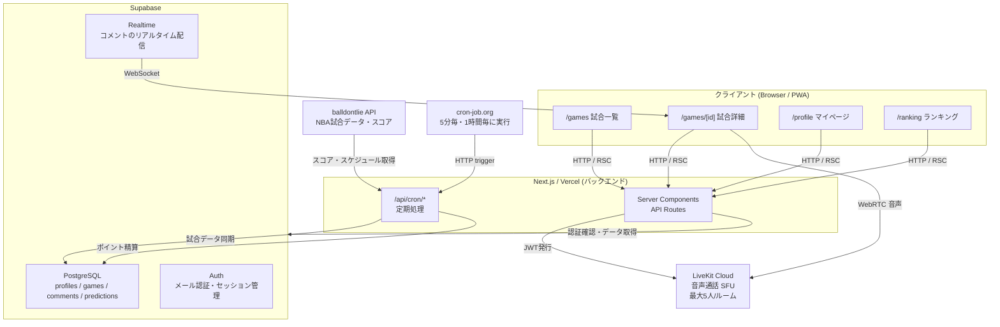
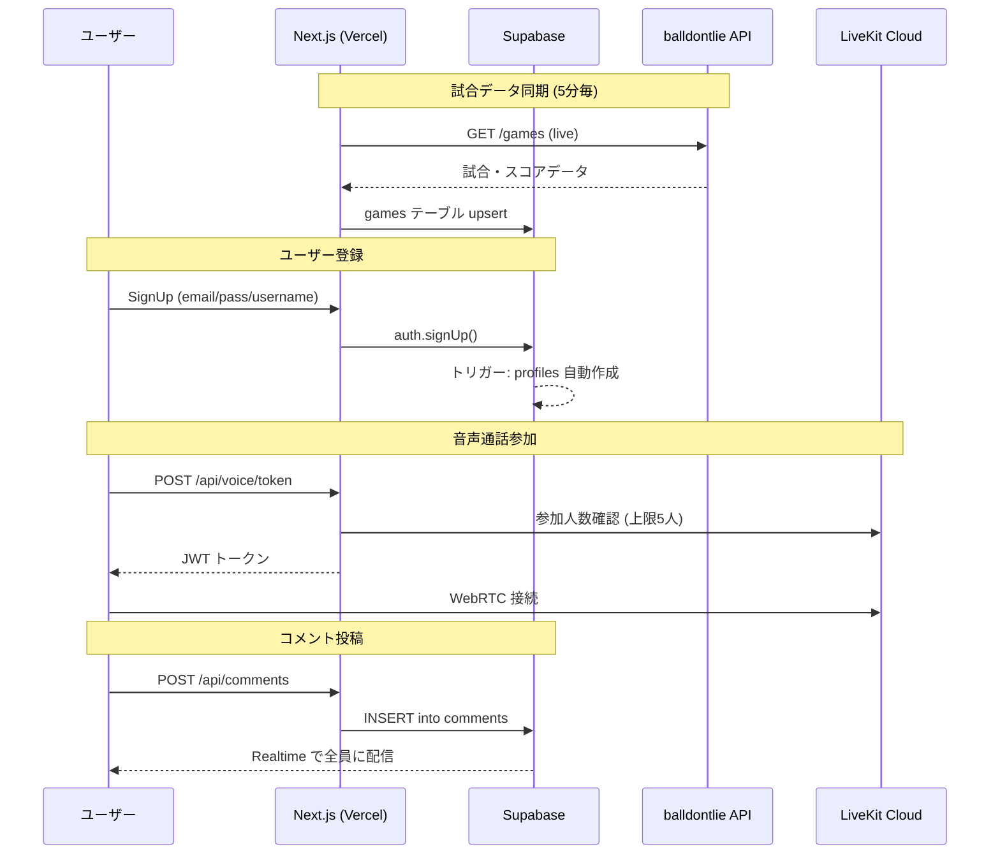

# HOOPMIN アーキテクチャ図

## システム全体図



## データフロー図



## 主要コンポーネント早見表

| 関心事 | 何を使っているか |
|---|---|
| **データソース（試合情報）** | balldontlie API（NBA公式スタッツ） |
| **認証** | Supabase Auth（メール＋パスワード） |
| **バックエンド** | Next.js API Routes（Vercel上のサーバーレス関数） |
| **DB** | Supabase PostgreSQL |
| **リアルタイム** | Supabase Realtime（WebSocket） |
| **音声通話** | LiveKit Cloud（WebRTC SFU） |
| **定期処理** | cron-job.org → Next.js API Routes |

---

## データフロー

### 試合データ同期
```
balldontlie API
  → /api/cron/sync-live (5分毎, cron-job.org)
  → Supabase games テーブル更新
  → revalidateTag('games') でキャッシュ破棄
  → 次のリクエストで最新データを表示
```

### ユーザー認証
```
SignUpForm
  → supabase.auth.signUp()
  → DBトリガー: handle_new_user() → profiles 自動作成
  → POST /api/profile (フォールバック)
  → /games にリダイレクト
```

### 予測・ポイント
```
ユーザーが予測投票
  → POST /api/predictions
  → オッズ計算 (チーム順位・点差・投票分布)
  → predictions テーブルに保存

試合終了
  → /api/cron/settle-predictions (1時間毎)
  → 正解者に points_earned を付与
  → profiles.points を加算
```

### 音声通話
```
ユーザーが「参加する」
  → POST /api/voice/token
  → LiveKit RoomService で参加人数確認 (上限5人)
  → JWT トークン発行
  → LiveKitRoom コンポーネントで接続
  → RoomAudioRenderer で音声再生
```

## 技術スタック

| レイヤー | 技術 | 用途 |
|---|---|---|
| フロントエンド | Next.js 16 (App Router) | UI・ルーティング |
| スタイル | Tailwind CSS | デザイン |
| 認証・DB | Supabase | Auth・PostgreSQL・Realtime |
| 音声通話 | LiveKit Cloud | WebRTC SFU |
| 外部データ | balldontlie API | NBA試合データ |
| デプロイ | Vercel | ホスティング |
| Cron | cron-job.org | 定期実行 |
| バリデーション | Zod | スキーマ検証 |

## コスト構造（現在）

| サービス | 無料枠 | 現在の使用量 |
|---|---|---|
| Vercel | 100GB帯域/月 | 極小 |
| Supabase | 500MB DB / 50,000 MAU | 極小 |
| LiveKit | 50,000分/月 | 極小 |
| balldontlie | 60req/分 | sync時のみ |
| cron-job.org | 無料 | 2ジョブ |

**現在のランニングコスト: $0/月**
